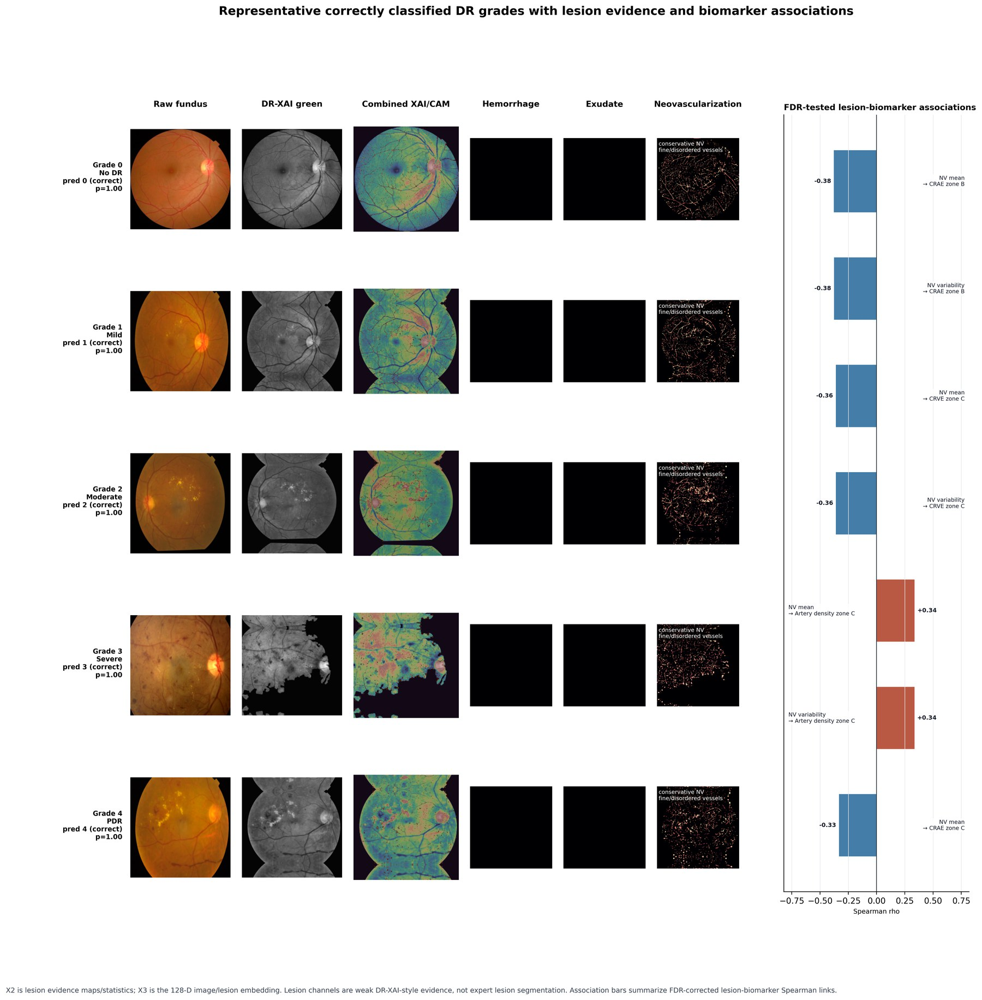

# Dual-Edge DR Graph XAI

Research code for an interpretable diabetic retinopathy grading framework that combines lesion evidence, retinal vessel information, AutoMorph biomarkers, and image-level graph structure.

The core method is a **dual-edge spatial-Jacobian image graph**:

- `X1`: AutoMorph vessel information from artery, vein, vessel, and zone maps.
- `X2`: DR-XAI-style lesion evidence maps and lesion statistics.
- `X3`: 128-D image/lesion embedding.
- `X4`: AutoMorph morphometric biomarkers, including global, zone B, and zone C measurements.
- `X12`: spatial vessel-lesion evidence from `X1 + X2`.
- `X34`: Jacobian embedding-biomarker evidence from `X3 + X4`.
- Final graph: fundus images are nodes; `E12` and `E34` define complementary edges; lightweight attention fuses the two branches.



This repository is organized as a clean implementation of our current methodology. It is not a copy of DR-XAI or AutoMorph. DR-XAI-style preprocessing is used to construct lesion-aware evidence, and AutoMorph outputs are used as vascular/morphometric biomarkers, but the X1-X4/X12-X34 graph construction, fusion, evaluation, and statistical interpretation pipeline are implemented here for this study.

## What the Main Figure Shows

The figure shows representative correctly classified cases across DR grades 0-4. Each row connects the original fundus image, DR-XAI-style green preprocessing, combined XAI/CAM evidence, lesion channels, conservative neovascularization evidence, and FDR-corrected lesion-biomarker associations.

In results terms, the figure supports the interpretation that the model is not only assigning a DR grade. It links image evidence to lesion signals and vascular biomarker changes. The quantitative tables should be used for accuracy, QWK, AUROC, and F1 claims; this figure explains the biological mechanism behind the predictions.

## Repository Layout

```text
configs/        YAML configs for the current matched APTOS DR-XAI graph run
docs/           README figure only
scripts/        core runnable pipeline stages
src/rxg/        minimal reusable package code
tests/          smoke tests and DR-XAI evidence tests
```

Large datasets, AutoMorph outputs, checkpoints, and generated experiment outputs are intentionally ignored by Git. Keep them outside the repository or publish them through a data archive such as Zenodo, OSF, institutional storage, or controlled-access release.

## Installation

Create a Python environment, then install the package:

```bash
python -m venv .venv
source .venv/bin/activate
pip install --upgrade pip
pip install -r requirements.txt
pip install -e .
```

For development and tests:

```bash
pip install -r requirements-dev.txt
```

## Data Inputs

The full pipeline expects:

1. A fundus image directory.
2. A labels CSV with `id_code` and `diagnosis` columns.
3. AutoMorph vessel maps and macular biomarker outputs.
4. A matched manifest so every image has aligned X1, X2, X3, and X4 streams.

Raw clinical images and third-party dataset files are not included in this repository.

## Current Updated Pipeline

The current clean branch uses:

```text
configs/non_augmented_dr_xai_updated.yaml
```

### 1. Build the strict matched APTOS manifest

```bash
PYTHONPATH=src python scripts/build_non_augmented_intersection.py \
  --config configs/non_augmented.yaml
```

### 2. Generate X2 lesion evidence and X3 embeddings

The combined builder writes both outputs in one pass:

```bash
PYTHONPATH=src python scripts/build_non_augmented_image_evidence.py \
  --manifest outputs_non_augmented/non_augmented_strict_intersection_manifest.csv \
  --x2-output outputs_non_augmented_dr_xai_updated/non_augmented_dr_xai_x2_lesion_evidence.csv \
  --x3-output outputs_non_augmented_dr_xai_updated/non_augmented_dr_xai_x3_image_embeddings.csv \
  --image-size 224
```

Important definition: `X2` is lesion evidence maps/statistics. The 128-D vector representation belongs to `X3`. In the output CSV, X3 columns are explicitly named:

```text
x3_image_embed_000 ... x3_image_embed_127
```

If you want to generate only X3, use the dedicated script:

```bash
PYTHONPATH=src python scripts/build_x3_image_embeddings.py \
  --manifest outputs_non_augmented/non_augmented_strict_intersection_manifest.csv \
  --output outputs_non_augmented_dr_xai_updated/non_augmented_dr_xai_x3_image_embeddings.csv \
  --image-size 224
```

### 3. Build X12, X34, graph edges, attention features, and statistics

```bash
PYTHONPATH=src python scripts/run_full_fusion_graph.py \
  --config configs/non_augmented_dr_xai_updated.yaml \
  --base-x1-x4 outputs_non_augmented/non_augmented_x1_x4_features_mice.csv \
  --x2-csv outputs_non_augmented_dr_xai_updated/non_augmented_dr_xai_x2_lesion_evidence.csv \
  --x3-csv outputs_non_augmented_dr_xai_updated/non_augmented_dr_xai_x3_image_embeddings.csv \
  --output outputs_non_augmented_dr_xai_updated/full_fusion_graph/non_augmented_dr_xai_spatial_jacobian_attention_graph_features.csv \
  --x4-scope zone_b_c_no_knudtson
```

This stage creates the image graph where nodes are fundus images and edges are built from spatial `E12` and Jacobian `E34` evidence.

### 4. Evaluate X1, X2, X3, X4, X12, X34, and the final full graph

```bash
PYTHONPATH=src python scripts/evaluate_train_val_test.py \
  --feature-csv outputs_non_augmented_dr_xai_updated/full_fusion_graph/non_augmented_dr_xai_spatial_jacobian_attention_graph_features.csv \
  --output-dir outputs_non_augmented_dr_xai_updated/full_fusion_graph/train_val_test_eval \
  --seed 42
```

The evaluation reports both five-class DR grading and binary referable DR metrics.

### 5. Generate statistical interpretation plots

```bash
PYTHONPATH=src python scripts/plot_interpretation_statistics.py \
  --features outputs_non_augmented_dr_xai_updated/full_fusion_graph/non_augmented_dr_xai_spatial_jacobian_attention_graph_features.csv \
  --hypothesis-tests outputs_non_augmented_dr_xai_updated/full_fusion_graph/hypothesis_tests_all_features.csv \
  --linkage outputs_non_augmented_dr_xai_updated/full_fusion_graph/lesion_biomarker_linkage.csv \
  --out-dir outputs_non_augmented_dr_xai_updated/full_fusion_graph/figures/interpretation_statistics
```

The statistical analysis includes grade-wise trend testing, Spearman association, and FDR correction.

### 6. Generate the class-wise lesion/XAI summary figure

```bash
PYTHONPATH=src python scripts/plot_dr_class_lesion_xai_summary_clean.py \
  --examples outputs_non_augmented_dr_xai_updated/full_fusion_graph/figures/dr_class_lesion_xai_summary/dr_all_classes_lesion_xai_association_examples.csv \
  --features outputs_non_augmented_dr_xai_updated/full_fusion_graph/non_augmented_dr_xai_spatial_jacobian_attention_graph_features.csv \
  --linkage outputs_non_augmented_dr_xai_updated/full_fusion_graph/lesion_biomarker_linkage.csv \
  --out-dir outputs_non_augmented_dr_xai_updated/full_fusion_graph/figures/dr_class_lesion_xai_summary \
  --image-size 224
```

## Current Internal APTOS Results

Updated DR-XAI-style pipeline, strict matched APTOS cohort, non-augmented images:

| Stream | Five-class Acc | Five-class QWK | Macro F1 | MAE | Adjacent Acc |
|---|---:|---:|---:|---:|---:|
| X1 vessel | 0.6409 | 0.5038 | 0.2832 | 0.6186 | 0.7887 |
| X2 lesion evidence | 0.7388 | 0.6720 | 0.4256 | 0.4244 | 0.8729 |
| X3 embedding | 0.7371 | 0.6325 | 0.4297 | 0.4433 | 0.8694 |
| X4 biomarkers | 0.6770 | 0.5809 | 0.3553 | 0.5498 | 0.8076 |
| X12 spatial | 0.7354 | 0.6890 | 0.4258 | 0.4124 | 0.8832 |
| X34 Jacobian | 0.7371 | 0.6782 | 0.4890 | 0.4467 | 0.8488 |
| Final full graph | 0.7680 | 0.7313 | 0.5140 | 0.3729 | 0.8900 |

Binary referable DR for the final full graph: accuracy `0.8694`, AUROC `0.9455`, sensitivity `0.8739`, specificity `0.8667`, F1 `0.8362`, AUPRC `0.9142`.

## Notes on Neovascularization

Neovascularization is handled conservatively. The lesion evidence code avoids generating excessive NV signal because true NV is less frequent than common lesions such as hemorrhage and exudates. This keeps the interpretation useful for PDR without biasing the model toward over-calling NV.

## Testing

```bash
PYTHONPATH=src pytest
```

If using the AutoMorph conda environment:

```bash
PYTHONPATH=src /path/to/automorph/env/bin/python -m pytest
```

## Citation

Citation information will be added after manuscript submission.
